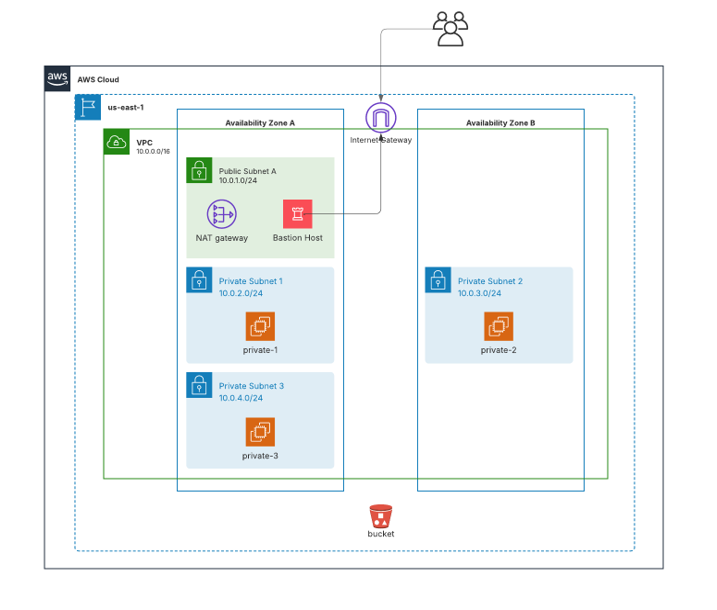

Pt 1.6 Terraform AWS - Hans Jeremi González Pin

Ejecución:

Entrar en la carpeta exercicis/pt-1-6

Ejecutar terraform fmt -recursive

Ejecutar terraform init

Obtener IP pública y ejecutar terraform apply pasando allowed_ip en formato /32

Postconfiguración SSH:

Ejecutar el script setup_ssh.sh

Comprobación:

Probar conexión ssh bastion

Probar conexión ssh private-1

Destrucción:

Ejecutar terraform destroy pasando allowed_ip (y private_instance_count si se cambió)

Topologia:

